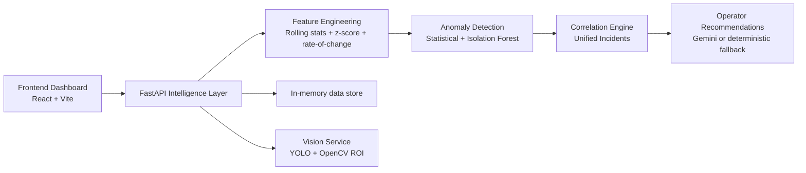

# Hack-X

OPTIMUS is an industrial intelligence and digital twin platform built for real-time factory monitoring, anomaly detection, incident correlation, and operator guidance.

This repository contains:

- A modern React + Vite frontend with a live digital twin dashboard
- A FastAPI-based intelligence layer for telemetry ingestion, anomaly detection, incident correlation, and AI recommendations

## Table of Contents

- Overview
- Architecture
- Tech Stack
- Repository Structure
- Getting Started
- Environment Variables
- Running the Project
- API Endpoints
- Testing
- Current Integration Notes

## Overview

The system combines simulated/real telemetry and computer vision signals to detect and correlate operational risks.

Core capabilities:

- Live digital twin UI for machines, incidents, and recovery actions
- Multi-signal anomaly detection for machine and energy telemetry
- Cross-domain incident correlation (machine + energy + vision)
- AI operator recommendations with Gemini support and deterministic fallback
- Predefined simulator scenarios for demo and validation

## Architecture



### Frontend

The frontend is a multi-page React app with route-level transitions and a digital twin experience.

Main routes:

- /dashboard (default route target)
- /home
- /platform
- /solutions
- /auth

The dashboard includes:

- Live twin canvas and machine panels
- Incident monitoring and recommendation retrieval
- Scenario trigger/reset controls against the backend simulator
- Offline/sandbox behavior when backend is unavailable

### Intelligence Layer

The backend is a FastAPI service that:

- Ingests machine, energy, and vision event payloads
- Processes telemetry into engineered features
- Detects anomalies using rule-based stats and Isolation Forest
- Correlates anomalies into unified incidents
- Generates recommendation payloads via Gemini (or fallback logic)

Data is stored in an in-memory database for demo/simulation workflows.

## Tech Stack

### Frontend

- React 19
- TypeScript
- Vite
- React Router
- Framer Motion
- Lucide React

### Backend

- FastAPI
- Uvicorn
- Pandas, NumPy
- scikit-learn (IsolationForest)
- OpenCV
- Ultralytics YOLO
- Google Generative AI SDK

## Repository Structure

```text
Hack-X/
	frontend/                 # React + Vite application
		src/
			pages/                # Home, Platform, Solutions, Dashboard, Auth
			digital-twin/         # Twin-specific UI components
			simulation/           # Frontend simulation engine and mock intelligence
			services/             # API service helpers

	intelligence_layer/       # FastAPI intelligence backend
		app/
			processors/           # Feature engineering, anomaly detection, correlation
			services/             # Gemini recommendation service, vision service
			schemas/              # Pydantic models
			main.py               # API entrypoints
			simulator.py          # Demo scenario runner
		run.py                  # Uvicorn startup script
		test_pipeline.py        # Integration-style test script
```

## Getting Started

### Prerequisites

- Node.js 18+ (recommended)
- Python 3.10+ (recommended)
- pip

### 1) Clone and enter the project

```bash
git clone <your-repo-url>
cd Hack-X
```

### 2) Set up the frontend

```bash
cd frontend
npm install
```

### 3) Set up the backend

```bash
cd ../intelligence_layer
python -m venv .venv
```

Activate virtual environment:

Windows PowerShell:

```powershell
.\.venv\Scripts\Activate.ps1
```

macOS/Linux:

```bash
source .venv/bin/activate
```

Install dependencies:

```bash
pip install -r requirements.txt
```

## Environment Variables

Create a .env file inside intelligence_layer/.

Supported variables:

- PORT (default: 8000)
- HOST (default: 0.0.0.0)
- GEMINI_API_KEY (optional, enables Gemini recommendation generation)
- ROLLING_WINDOW (default: 10)
- CORRELATION_THRESHOLD (default: 0.6)
- TIME_WINDOW_SECONDS (default: 300)

Example:

```env
PORT=8000
HOST=0.0.0.0
GEMINI_API_KEY=your_key_here
ROLLING_WINDOW=10
CORRELATION_THRESHOLD=0.6
TIME_WINDOW_SECONDS=300
```

If GEMINI_API_KEY is not set, recommendation generation automatically falls back to deterministic rule-based outputs.

## Running the Project

Run backend first:

```bash
cd intelligence_layer
python run.py
```

Then run frontend:

```bash
cd frontend
npm run dev
```

Build frontend:

```bash
npm run build
```

Preview production build:

```bash
npm run preview
```

## API Endpoints

Base URL: http://localhost:8000

Core:

- GET /
- GET /docs

Ingestion:

- POST /api/ingest/machine
- POST /api/ingest/energy
- POST /api/ingest/vision
- POST /api/vision/process-frame

Observability:

- GET /api/anomalies
- GET /api/incidents
- GET /api/incidents/machine/{machine_id}
- GET /api/recommendations/{incident_id}

Simulation:

- POST /api/simulator/trigger
- POST /api/simulator/reset

Simulator scenarios accepted by /api/simulator/trigger:

- mechanical
- safety
- false_spike

## Testing

Run backend integration tests:

```bash
cd intelligence_layer
python test_pipeline.py
```

The test pipeline validates:

- API health/root endpoint
- Mechanical degradation scenario
- Safety + machine correlation scenario
- False spike filtering behavior

## Current Integration Notes

- The frontend includes both:
  - A rich local twin simulation engine in src/simulation
  - Live backend polling/controls in the dashboard
- Several dashboard/twin requests call http://localhost:8000 directly.
- The service abstraction in src/services/factoryApi.ts defines different generic endpoints and may not fully match the current FastAPI routes.

If you want stricter environment-based API configuration, align all frontend calls through a single API base (for example via VITE_API_URL) and route-consistent service helpers.
